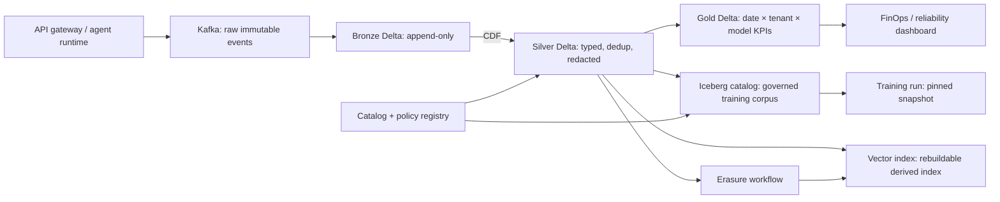

# Architecture Brief — Lakehouse cho LLM Observability ở quy mô 1B request/ngày

## 1. Bài toán và ràng buộc

Một nền tảng AI phục vụ 1 tỷ request/ngày cần lưu prompt metadata, model/version,
latency, token usage, cost, error, trace agent và dữ liệu đánh giá. Mục tiêu là
dashboard p95/cost chậm dưới 10 phút, điều tra một request trong dưới 30 giây, giữ
raw log 30 ngày, dữ liệu aggregate 13 tháng, và có thể xóa dữ liệu người dùng cũng
như mọi derived vector/index liên quan. Ngân sách mục tiêu cho storage + truy vấn
là dưới $80K/tháng; độ trễ ghi không được làm chậm serving path.

Payload nhạy cảm không đi qua log mặc định. Mỗi record có `request_id`,
`event_ts`, `model`, `model_version`, token/cost/latency, trạng thái redaction,
tenant và provenance. Nội dung prompt chỉ được lưu theo consent và policy cụ thể.

## 2. Thiết kế và các quyết định

### Quyết định 1 — Delta cho telemetry nóng; Iceberg cho corpus được catalog quản lý

Bronze, Silver và Gold dùng Delta vì commit log, Change Data Feed (CDF), `MERGE`
và time travel phù hợp luồng dedup/erasure nhanh. Corpus training dùng Iceberg qua
REST catalog để nhiều engine khám phá cùng schema, hidden partitioning và partition
evolution ổn định.

| Alternative bị loại | Lý do |
|---|---|
| Chỉ Parquet theo thư mục | Không có atomic commit, schema/partition evolution và time travel đáng tin cậy. |
| Một format cho mọi bảng | Đơn giản ban đầu nhưng bỏ qua CDF mạnh của Delta hoặc catalog-native workflow của Iceberg. |

### Quyết định 2 — Medallion và semantic contract ở Silver

Bronze nhận event thô, schema permissive và có thể replay. Silver chuẩn hóa thời
gian UTC, validate schema, dedup bằng `request_id`, redaction PII và attach policy /
provenance. Gold chỉ chứa aggregate cho dashboard. Dashboard không quét Bronze;
vì vậy chi phí và p95 ổn định dù raw log lớn.

| Alternative bị loại | Lý do |
|---|---|
| Dashboard đọc Bronze trực tiếp | Dễ đếm trùng, scan nhiều dữ liệu, dễ lộ field nhạy cảm. |
| Chỉ một bảng “clean” | Mất khả năng replay khi parser/policy thay đổi. |

### Quyết định 3 — Partition theo ngày và tenant; Z-order theo truy vấn phổ biến

Silver partition theo `event_date` và `tenant_id` (tenant lớn được bucket) để TTL,
isolation và pruning. Các file được compact về 256–512 MB; Z-order theo
`request_id` và `model` ở partition nóng. Iceberg dùng `day(event_ts)` thay vì
`event_date` do người viết tự tạo, để query filter trên cột nguồn vẫn prune file.

| Alternative bị loại | Lý do |
|---|---|
| Partition theo `request_id` | Cardinality cực cao tạo small-file catastrophe. |
| Chỉ Z-order, không partition thời gian | Retention và scan theo khoảng thời gian phải đọc quá nhiều metadata/file. |

### Quyết định 4 — Vector index là derived artifact, bảng là system of record

Embedding, model embedding version, consent state và `doc_id` nằm trong Silver/Iceberg.
Index ANN chỉ là bản sao phục vụ online. Worker tiêu thụ Delta CDF gồm `insert`,
`update` **và `delete`**, ghi watermark/version đã áp dụng. Nếu lag hoặc không chắc
toàn vẹn, index bị mark unhealthy và rebuild từ table version đã pin.

| Alternative bị loại | Lý do |
|---|---|
| Vector DB là source of truth | Delete, consent/provenance và audit dễ lệch khỏi lakehouse. |
| Đồng bộ upsert mỗi đêm | Bỏ delete; dữ liệu đã xóa vẫn có thể được RAG trả về. |

### Quyết định 5 — Catalog + policy-as-data, không chỉ ACL ở dashboard

Mỗi table có owner, classification, retention, consent source và allowed purpose.
Catalog cấp table identity; policy registry versioned được join ở Silver. Training
run ghi Iceberg snapshot ID/Delta version, filter policy version, embedding model
và số record vào manifest bất biến.

| Alternative bị loại | Lý do |
|---|---|
| Kiểm soát bằng tài liệu/Slack | Không enforce được và không audit/replay được. |
| Chỉ kiểm tra quyền khi train | Raw/Silver và vector index vẫn có thể đã lộ dữ liệu sai purpose. |

## 3. Số học dung lượng và chi phí

Giả định 1B request/ngày × 2.5 KB sau nén ở Bronze = 2.5 TB/ngày, hay 75 TB/tháng.
Silver sau projection, redaction và dedup giữ 1.2 KB/event = 36 TB/tháng. Gold có
1,000 tenant × 50 model × 365 ngày × 24 giờ, khoảng 438M aggregate row/năm nhưng
chỉ lưu metric hẹp; giả định 100 GB/tháng.

| Hạng mục | Giả định | Chi phí tháng (USD) |
|---|---:|---:|
| Bronze hot 30 ngày | 75 TB × $23/TB-tháng | $1,725 |
| Silver hot 90 ngày | 108 TB × $23/TB-tháng | $2,484 |
| Bronze/Silver cold archive 12 tháng | 1,056 TB × $4/TB-tháng | $4,224 |
| Gold 13 tháng | 1.3 TB × $23/TB-tháng | $30 |
| Metadata, replicas, vector snapshots (20%) | trên storage hot | $842 |
| Compute streaming/compaction/query | reserved + autoscale estimate | $45,000 |
| **Tổng ước tính** |  | **$54,305/tháng** |

Con số trên là planning estimate, không phải báo giá cloud. Giả định đắt nhất là
compute: cần đo TB scanned/query, file count, cache hit-rate và peak concurrency
hàng tuần. Giảm small files thường rẻ hơn tăng compute: 2 triệu object có thể thêm
hàng trăm USD/tháng chỉ ở phí request/maintenance.

## 4. Cơ chế vận hành và failure modes

| Failure mode | Dấu hiệu phát hiện | Xử lý và rollback |
|---|---|---|
| Micro-batch sinh hàng triệu small files | file count/TB tăng, planning p95 tăng | Dừng writer trigger quá nhỏ; compact partition hôm qua; xác nhận metrics rồi nâng target size. |
| Parser Silver phát hành bug | anomaly rate hoặc schema-reject spike | Giữ Bronze; rollback code, tạo Silver version mới bằng replay, không sửa lịch sử thầm lặng. |
| Vector index bỏ CDF delete | watermark index tụt; erasure audit có hit ở index | Chặn serving retrieval cho tenant ảnh hưởng, replay delete theo CDF rồi full rebuild từ pinned table version nếu checksum không khớp. |
| Snapshot expiry giảm metadata nhưng S3 bill không giảm | snapshot count giảm nhưng orphan byte không đổi | Sweep file không được tham chiếu sau retention window; inventory trước/sau; không xóa khi reader cũ còn SLA. |
| Training dùng corpus sai policy | manifest thiếu snapshot/policy version hoặc có UNCLASSIFIED | Hủy run, revoke model artifact khỏi registry, tái tạo manifest từ snapshot policy-compliant và retrain. |

Maintenance là SLO: compact hằng ngày bảng nóng, cluster theo workload hằng tuần,
expire snapshot theo retention, orphan sweep sau grace period, và rewrite checkpoint/
manifest khi planning latency vượt ngưỡng. `VACUUM` không thay thế orphan sweep:
file chưa từng commit không tồn tại trong Delta log để vacuum thấy.

## 5. MVP một tuần

**Ngày 1–2:** ingest 10M event/day giả lập vào Bronze Delta, Silver dedup/redaction
và Gold theo ngày × model. Acceptance: Silver ít row hơn Bronze khi có retry; Gold
có p50/p95/cost/error-rate và query 7 ngày dưới 30 giây.

**Ngày 3:** thực hiện compact + Z-order; ghi file count, bytes scanned và pruning
ratio trước/sau. Acceptance: giảm ít nhất 10× file nhỏ hoặc prune ít nhất 90% file
cho query `request_id`.

**Ngày 4:** corpus Iceberg qua catalog với `day(event_ts)` và rename field.
Acceptance: filter trên `event_ts` prune ít nhất 5×; field ID không đổi sau rename;
hai partition spec cùng đọc được.

**Ngày 5:** index giả lập tiêu thụ CDF và erasure. Acceptance: sau delete, table và
index đều trả 0 hit; forced failure cho thấy alert khi watermark lag.

**Ngày 6–7:** training manifest pin snapshot/version, dashboard maintenance và
tabletop rollback. Acceptance: replay trả đúng số record của manifest; một orphan
sweep có inventory/byte evidence; không có dữ liệu `UNCLASSIFIED` trong training set.

## 6. Vì sao thiết kế này khả thi

Thiết kế tách serving path khỏi storage path, nên ingestion có thể backpressure
Kafka mà không chặn inference. Delta CDF biến xóa và thay đổi thành event có thể
tiêu thụ; Iceberg catalog mang table identity, hidden partition và schema evolution
vào corpus. Pin version biến “dữ liệu nào đã train model này?” từ câu hỏi điều tra
thành một lookup. Các phép đo file count, planned files, orphan bytes, watermark và
snapshot age là tiêu chí vận hành cụ thể để đội ngũ biết kiến trúc đang còn đúng.
